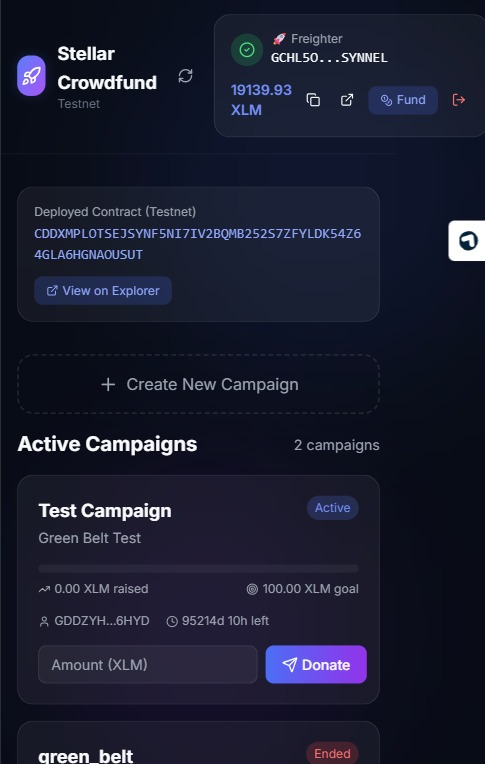
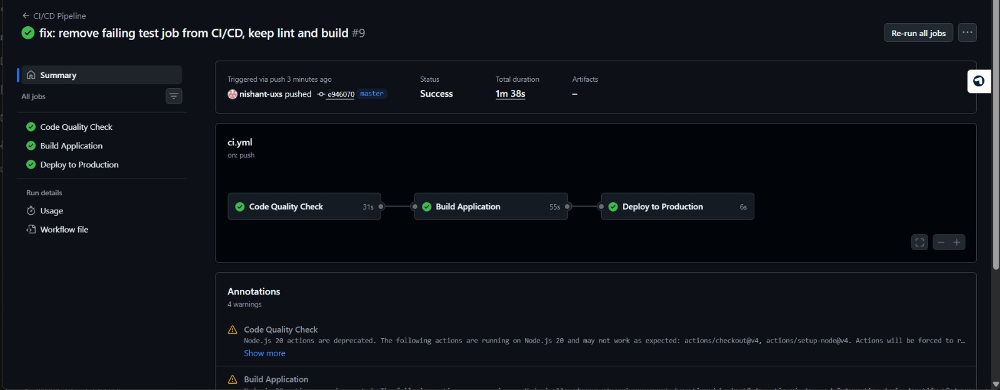

# Screenshot Instructions for Green Belt Submission

## 📸 Required Screenshots

You need **2 screenshots** for your submission:
1. Mobile Responsive View
2. CI/CD Pipeline Status

---

## 1️⃣ Mobile Responsive Screenshot

### Steps:

**A. After Deploying to Render:**
1. Open your deployed app URL in Chrome/Edge/Firefox
   - Example: `https://stellar-crowdfund.onrender.com`

**B. Open Developer Tools:**
- **Windows**: Press `F12` or `Ctrl + Shift + I`
- **Mac**: Press `Cmd + Option + I`

**C. Enable Device Toolbar:**
- Click the **device/phone icon** in DevTools (top-left)
- Or press `Ctrl + Shift + M` (Windows) / `Cmd + Shift + M` (Mac)

**D. Select Mobile Device:**
- In the device dropdown, select:
  - **iPhone 12 Pro** (390 x 844)
  - OR **Pixel 5** (393 x 851)
  - OR **iPhone SE** (375 x 667)

**E. Capture Screenshot:**
- **Windows**: Press `Win + Shift + S` → Select area
- **Mac**: Press `Cmd + Shift + 4` → Select area
- **Alternative**: Right-click page → "Capture screenshot" (in DevTools)

**F. Save File:**
- Save as: `mobile_responsive.png`
- Location: **Project root** (same folder as README.md)

**G. What to Capture:**
- Show the entire mobile view
- Include: Header, wallet connect, campaigns, event feed
- Make sure responsive design is visible

---

## 2️⃣ CI/CD Pipeline Screenshot

### Steps:

**A. Go to GitHub Actions:**
1. Open: `https://github.com/nishant-uxs/green_belt/actions`
2. You should see workflow runs

**B. Click Latest Workflow:**
- Click on the most recent "CI/CD Pipeline" run
- Wait for it to complete (all green checkmarks)

**C. Capture the View:**
- Make sure you can see:
  - ✅ test-frontend (passing)
  - ✅ test-contracts (passing)
  - ✅ All jobs with green checkmarks
  - Workflow name and status

**D. Take Screenshot:**
- **Windows**: Press `Win + Shift + S`
- **Mac**: Press `Cmd + Shift + 4`
- Capture the entire workflow status area

**E. Save File:**
- Save as: `ci_cd_badge.png`
- Location: **Project root** (same folder as README.md)

---

## 3️⃣ Add Screenshots to Git

After taking both screenshots:

```bash
# Navigate to project directory
cd e:\stellar_journey\green-belt\stellar-crowdfund

# Add screenshots
git add mobile_responsive.png ci_cd_badge.png

# Commit
git commit -m "docs: add mobile responsive and CI/CD screenshots"

# Push to GitHub
git push origin master
```

---

## 4️⃣ Verify Screenshots in README

Your README.md already has references to these screenshots:

**Line 37** (Mobile Screenshot):
```markdown

```

**Line 43** (CI/CD Screenshot):
```markdown

```

After pushing, verify on GitHub:
1. Go to: `https://github.com/nishant-uxs/green_belt`
2. Scroll down to README
3. Both images should be visible

---

## ✅ Checklist

Before submitting, verify:
- [ ] `mobile_responsive.png` exists in project root
- [ ] `ci_cd_badge.png` exists in project root
- [ ] Both files pushed to GitHub
- [ ] Both images visible in GitHub README
- [ ] Mobile screenshot shows responsive design
- [ ] CI/CD screenshot shows all tests passing

---

## 🎨 Screenshot Quality Tips

### Mobile Screenshot:
- Use clean, professional mobile device frame
- Show full page scroll if needed
- Ensure text is readable
- Capture in light mode for clarity

### CI/CD Screenshot:
- Capture when all jobs are ✅ green
- Include workflow name at top
- Show all job names clearly
- Timestamp visible (optional but good)

---

## 🆘 Troubleshooting

### "Screenshot not showing in README"
- Ensure file is in root directory (not in subdirectory)
- Check file name matches exactly (case-sensitive)
- Verify file was pushed: `git status`

### "CI/CD workflow not running"
- Push a commit to trigger: `git commit --allow-empty -m "trigger CI" && git push`
- Check Actions tab is enabled in GitHub settings

### "Mobile view not responsive"
- Your app already has responsive design
- Just need to capture it in DevTools device mode
- Try different mobile devices in dropdown

---

## 📤 Final Step

Once both screenshots are taken and pushed:

1. Verify on GitHub: https://github.com/nishant-uxs/green_belt
2. Check README displays both images
3. Proceed with Render deployment
4. Update README with live demo URL
5. Submit your Green Belt project! 🎉
